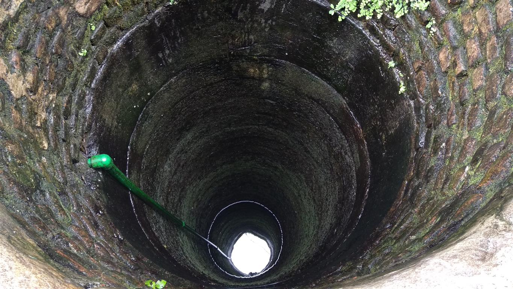
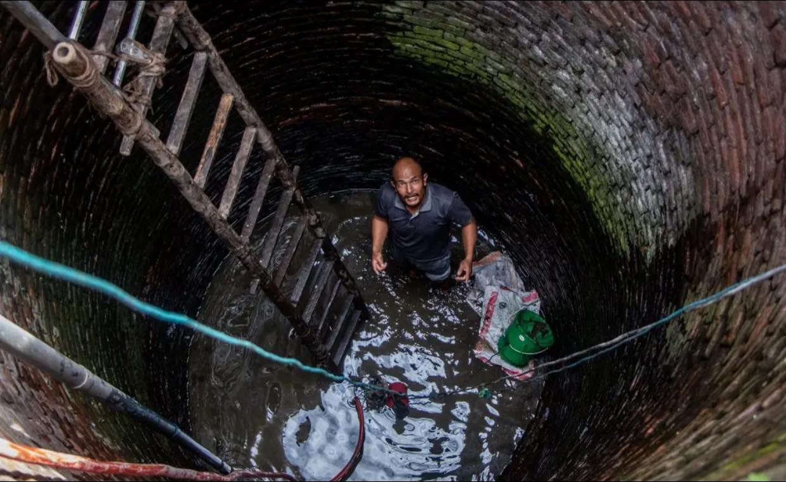
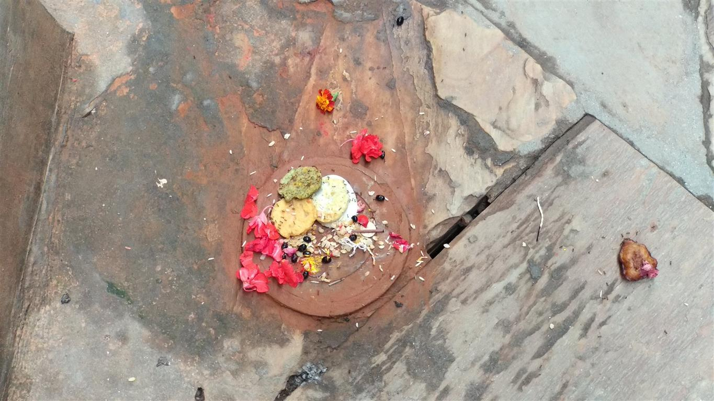
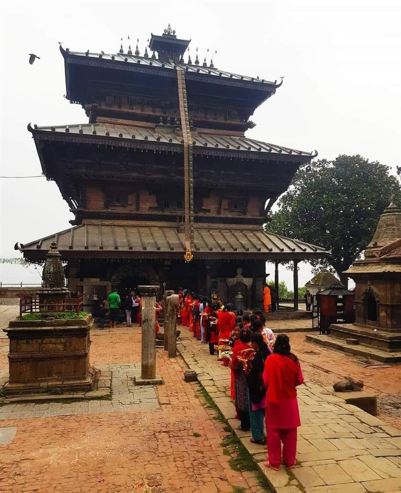
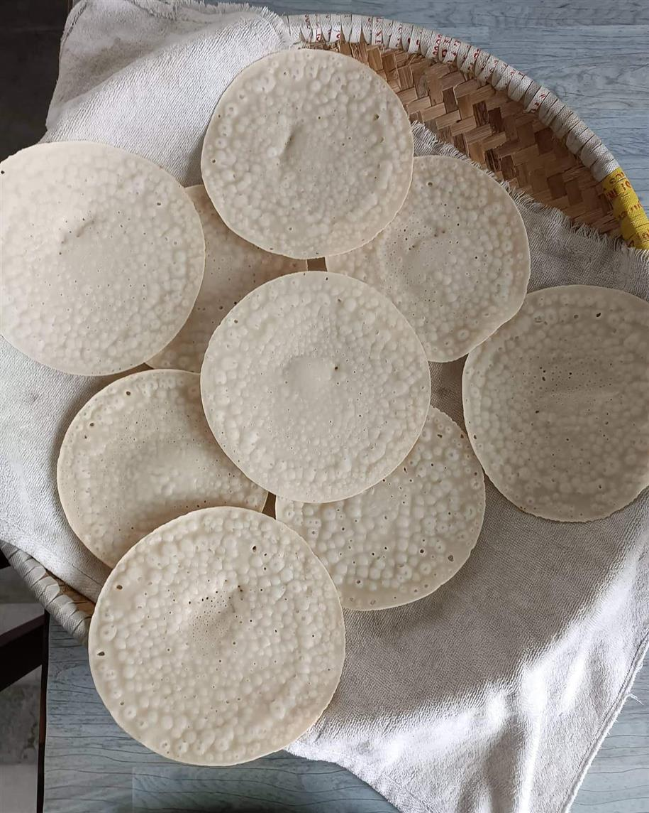

## Sithi: Na:kha: (सिथि नख:)
## An ancient and scientific festival.
05.06.2022

Water is respected as a divine component instead of fair an basic utility for the inborn Newa individuals of Kathmandu. Kumar, the rain child spoken to by water drops, is accepted to drop onto the soil after many months of development within the cloud mother goddess.

Sithi Nakha is one of the vital celebrations within the Newar community which is celebrated each year on the 6th day of the shinning fortnight of Jestha. According to Hindu mythology, it is said that the day is devoted to Lord Kumar Kartikeya, the primary child of Master Shiva and Goddess Parvati. Another title for the day is Kumar Shashthi. The celebration is celebrated in honor of Kumar. Thus this day is additionally known as Kumar Shasthi.

The Newar community celebrates the Sithi Nakha celebration to check the starting of the storm season by cleaning water sources such as lakes, wells, and stone gushes. Individuals moreover plan conventional flapjacks such as Bara and Chatamari as a tribute to their genealogical god. The nourishment things are not fair for taste. They are tall in carbohydrates, protein, press, etc. As the rainstorm approaches, bodies are uncovered to diverse sorts of microbes and these sorts of nourishment increment the insusceptibility of one’s body.

A inhabitant from the Newar community plans conventional Bara hotcakes in celebration of the Sithi Nakha celebration in Kathmandu, Nepal. Particularly Bara / Wo (Newari dish made of lentils) and Chatamari (Newari dishes made of rice flour) are served on this day.

This Sithi Nakha celebration too highlights the significance of water source preservation and the require for clean water. Nowadays, it is standard to adore around wells, boreholes, and lakes and to clean up some time recently revere. In this way, after everybody has assembled and worshiped, the far-reaching custom of being religiously and socially compelled not to litter there all through the year is commendable.

It is accepted that the water asset ought to be closed for some days after cleaning in Sithi Nakha to stabilize the water level. When water is cleaned, it is cleaned by entering interior the burrowed wells, lakes, and boreholes, and by doing so, the underneath squanders like mud, sediment, and silt come up to the surface of the water.

It is accepted that the water asset ought to be closed for some days after cleaning in Sithi Nakha to stabilize the water level. When water is cleaned, it is cleaned by entering interior the burrowed wells, lakes, and boreholes, and by doing so, the underneath squanders like mud, sediment, and silt come up to the surface of the water.

The Newa have continuously accepted that children are divine beings, and Kumar truly implies youthful man, or ruler. The wooden picture of Kumar housed in its Dyo Chhen within the ancient portion of Kathmandu is painted ruddy. In Newa dialect, a youthful infant is known as Hyaun Macha (<i>hyaun</i> = red, <i>macha</i> = child).

Sithi Nakha is the final day for the Newa individuals to perform their yearly Depuja, the communal revere of their clan god. The yearly cleaning day of open structures like roadside covers, sanctuary rooftops and water sources (wells, lakes, Hiti water conduits, etc.) moreover drop on this day. (pictured above)

<h1>Changed times and changed stories </h1>

In the ancestors' time, public ponds, wells, and taps were the only source of drinking water, so people had to keep them clean to drink clean and pure water throughout the year, but times have changed today, and most households now have their own tanks for storage of water, which has led to a decrease in the cleaning practise of wells in the past few years. Only a few popular water bodies are kept clean during Sithi Nakha, whereas other ones have been neglected. 

